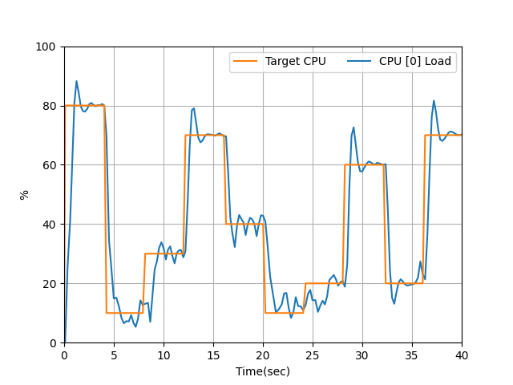

# CPU Load Generator

[](https://github.com/GaetanoCarlucci/CPULoadGenerator/actions)
[](http://opensource.org/licenses/MIT)
[](https://www.python.org/)

This script generates a fixed CPU load for a finite or indefinite time period, on one or more CPU cores. A **PI controller** is used for this purpose.

You provide the desired CPU load and the CPU core(s) to load. The controller and the CPU monitor run in separate threads.

**Supported platforms:** Linux, macOS, and Windows (Windows is less tested; `psutil` supports CPU affinity on all three).

## Theoretical insight

- **Project homepage:** [https://gaetanocarlucci.github.io/CPULoadGenerator/](https://gaetanocarlucci.github.io/CPULoadGenerator/) — more details on the tool.
- **Blog:** [Theoretical explanation of this tool](https://gaetanocarlucci.altervista.org/cpu-load-generator-project/).

## Dependencies

- **Python 3.9+** (tested with 3.13)
- **Libraries:** `matplotlib`, `psutil`, `click`

### Setup (Linux and macOS)

Create and activate a virtual environment, then install dependencies:

```bash
cd CPULoadGenerator/
python3 -m venv venv
source venv/bin/activate
pip install -r requirements.txt
```

Run the script (e.g. 20% load on core 0 for 10 seconds):

```bash
python cpu_load_generator.py -l 0.2 -d 10 -c 0
```

Or make the script executable and run: `chmod +x cpu_load_generator.py` then `./cpu_load_generator.py -l 0.2 -d 10 -c 0`.

**System-wide install (Debian/Ubuntu):** `sudo apt install python3-matplotlib python3-psutil python3-click`

**Platform notes:** On **macOS**, CPU affinity is not supported, so the load may be distributed across cores. Use **exactly one core** with `--plot` for the live plot window and PNG (e.g. `-c 0 -l 0.5 -d 20 --plot`); with multiple cores, `--plot` is ignored.

## Examples

1. **20% load on core 0 for 20 seconds:**

   ```bash
   ./cpu_load_generator.py -l 0.2 -d 20 -c 0
   ```

2. **65% load on cores 0, 1 and 5, until interrupted (Ctrl-C):**

   ```bash
   ./cpu_load_generator.py -l 0.65 -c 0 -c 1 -c 5
   ```

3. **55% load on core 0, 12% on core 3, until interrupted:**

   ```bash
   ./cpu_load_generator.py -c 0 -c 3 -l 0.55 -l 0.12
   ```

4. **12% load on cores 0 and 1 for 20.5 seconds, then plot the load:**

   ```bash
   ./cpu_load_generator.py -l 0.12 -c 0 -c 1 -d 20.5 --plot
   ```

5. **Example graph of CPU load (50% target on core 0):**

   

## Tests

Test and identification scripts live in `tests/` (see `tests/README.md`). Expected output from the PID script after CPU identification:


